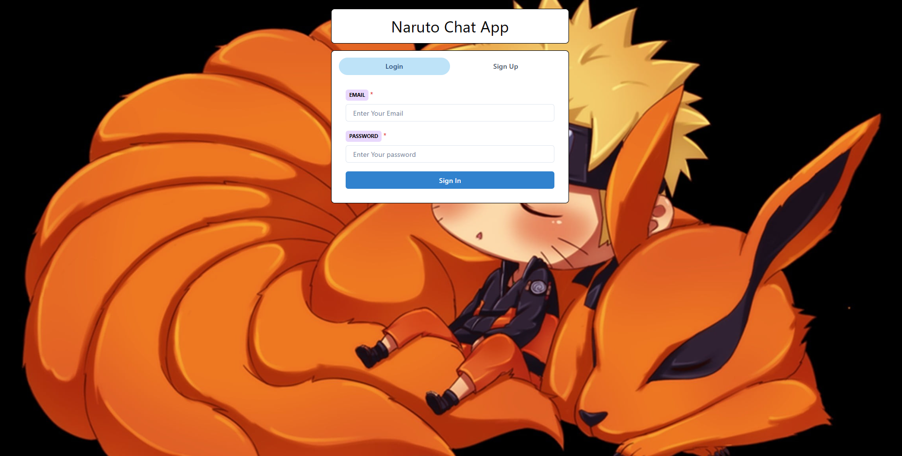
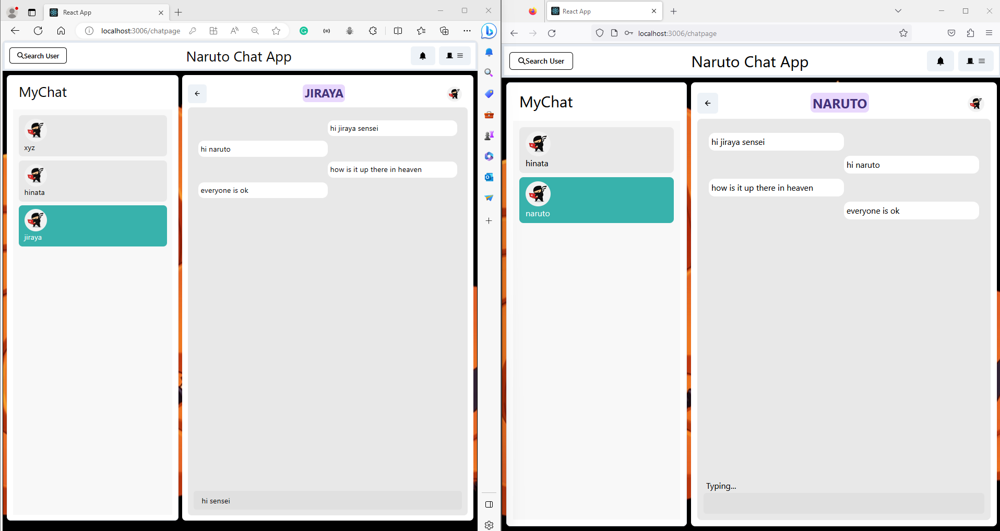
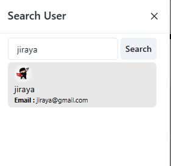

# MERN Chat App with Socket.io

 <!-- Replace with an actual screenshot of your app -->

This is a real-time chat application built using the MERN (MongoDB, Express, React, Node.js) stack and Socket.io for handling real-time communication.

## Features

- Real-time messaging using Socket.io.
- User authentication and registration.
- Display of online/offline status for users.
- Message history and conversation tracking.
- Responsive design for mobile and desktop.

## Technologies Used

- MongoDB: Store user data and chat history.
- Express: Handle server-side logic and API routes.
- React: Build the user interface and components.
- Node.js: Run the server environment.
- Socket.io: Enable real-time communication.
- [Other libraries or tools you've used]

## Installation

1. Clone the repository: `git clone https://github.com/bk201grsameer/Chat_Project_MERN.git`
2. Navigate to the project directory: `cd Chat_Project_MERN`
3. Install server dependencies: `npm install`
4. Navigate to the client directory: `cd client`
5. Install client dependencies: `npm install`
6. Return to the project root: `cd ..`
7. Rename `.env.example` to `.env` and provide necessary configuration values.

## Usage

1. Start the server: `npm start`
2. Navigate to the client directory: `cd client`
3. Start the client: `npm start`
4. Open your browser and go to `http://localhost:3000` to access the app.

## Configuration

- Rename `.env.example` to `.env` in both the server and client directories.
- Update the environment variables with your own configuration settings.

## Screenshots

<!-- Add more screenshots if necessary -->

## Contributing

Contributions are welcome! If you'd like to contribute to the project, please follow these steps:

1. Fork the repository.
2. Create a new branch for your feature: `git checkout -b feature-name`
3. Commit your changes: `git commit -m "Add feature"`
4. Push to the branch: `git push origin feature-name`
5. Open a pull request explaining your changes.

## License

This project is licensed under the [MIT License](LICENSE).

## Reference Link
https://github.com/piyush-eon/mern-chat-app

## Contact

For questions or feedback, you can reach us at sameerkarn369369@email.com.

